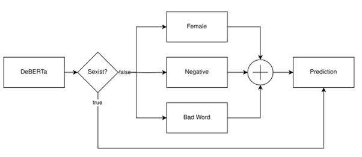
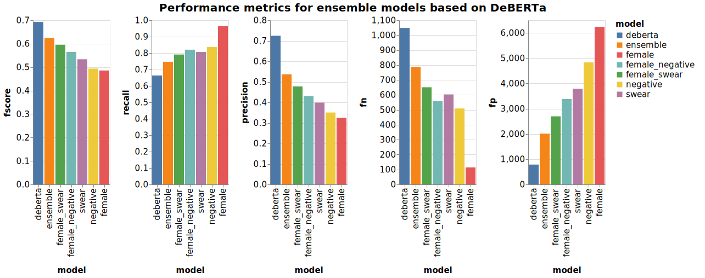
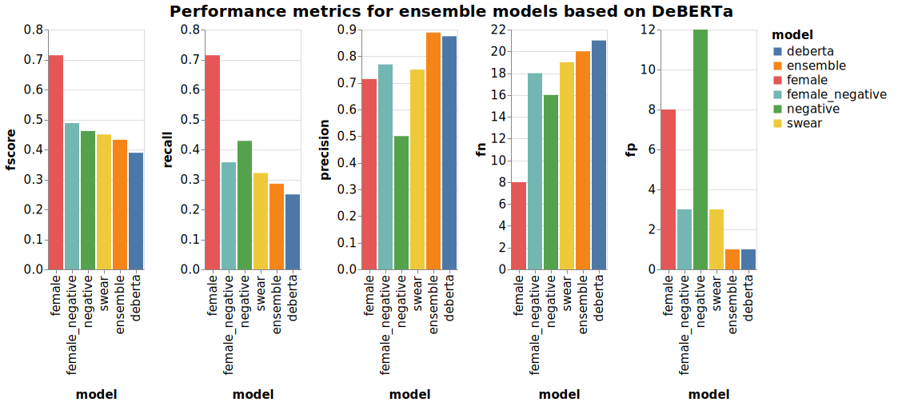

# label-legends

## Development

We are storing the project dependencies and do the project setup using the [pyproject.toml](./pyproject.toml) file.
To install the package with the dependencies in a new Python virtual environment:

```bash
uv sync
```

If you do not have uv available, you can also use pip directly in an already set up Python environment:

```bash
pip install -e .
```

> NOTE: If you install the project using pip, make sure to manually install the development dependencies listed in `[dependency-groups]`. If you are using CUDA, consider installing the libraries in the 'gpu' group.

## Model documentation

Our non-baseline models will be documented using MLflow under our self-hosted tracking server available on https://mlflow.mahluke.page. Authentication is done using Basic-Auth, a lecturer account is created with READ permissions. Use 'lecturer' as username and 'tuw-nlp-ie-2024WS' as password.

You can also find the default xgboost model and the tuned xgboost model there, as well as the DistilBERT model, trained with 3 and 50 epochs.

## Milestone 1

The download of the data and basic loading is done in [load.ipynb](./notebooks/load.ipynb).

Exploration and cleaning of the data is done in [db_investigate.ipynb](./notebooks/db_investigate.ipynb).
Saving to CoNNL-U format of the dataset is done in [create_conllu.ipynb](./notebooks/create_conllu.ipynb), make sure to execute the other 2 notebooks first.

## Milestone 2

First we finished up any preprocessing steps that were left and got our clean dataset where the text is available in raw format, lemmatized and converted to ids.
For every following baseline we are using the format that best fits the model.

We chose 5 baseline models that somewhat align with the baseline models from the paper we were supposed to read at the beginning of the project. Here is a list of our balesines:

- Most Frequent
- Regex using Badwords
- XGBoost
- DistillBERT
- DeBERTa-v3-base

Every baseline model has its own notebook in order to maintain a structure and for the group members to be able to work on different models at once. The implementation, result and any useful information for every baseline is provided below.

### Most Frequent baseline

Most Frequent is our basic baseline. This calculates the most frequent class from the target column and labels everything that class as prediction.
This baseline will of course be the one that performs the worst. If we only look at the accuracy, we think it is a quite good model (0.74), but every other metric is 0 which tells us that that is not the case.
The baseline is implemented in the [_notebooks/mostFrequent.ipynb_](./notebooks/mostFrequent.ipynb) file.

### Regex baseline

For the second baseline we chose a regex based one. The purpose of this was to see how well we can predict the labels using a common _badword_ dataset. If a text had a word that could be found in the bad*word dataset, it would be labelled "sexist", if not, the label would be "not sexist".
With this we achieved better scores on average but worse accuracy (0.59). But most misclassifications were "sexist" instead on "not sexist" which is better than the other way around.
The baseline is implemented in the [_notebooks/regex.ipynb_](./notebooks/regex.ipynb) file.

### XGBoost baseline

As traditional ML baseline we chose XGBoost, a tree-based model which is often used as a baseline. It was also used in the paper we are reproducing, which allows us to compare the results we achieved to those from the paper. The paper reports a fscore of 49.3% which is slightly lower than the score we achieved of 51.5%.

After doing the error analysis we also added hyperparameter optimization of the model by using SMAC-3, which yielded slightly better results of a fscore of 55.7% compared to 51.5% for the default configuration. We did the optimization over 1300 models, which took 30 minutes. It also shows the limitations of this traditional approach of machine learning for our NLP task: Using only tf-idf as features seems to contain too little information to allow the model to create a well enough distinction of whether a text is sexist.
XGBoost was very performant, requiring substantially less time for both training and prediction on the test set. It could be used e.g. in an environment where it is substantial to get predictions within milliseconds or when only limited computational power is available.

The baseline is implemented in the [_notebooks/xgBoost.ipynb_](./notebooks/xgBoost.ipynb) file.

### DistilBERT baseline
To keep in line with the aforementioned paper, we decided to include distilBert as one of the transformer-based DL models. The choice for distilBert was also due to the decision to implement the DeBERTa-v3-base version of BERT. This is because DistilBERT is a lightweight version of the BERT family of pre-trained models, and so it can help us infere whether the higher complexity is really required for our objectives. The model was trained for three epochs (later increased to 50 when running with CUDA), with a learning rate of 2*10e-5 and an initial batch size of 8 (later increased to 100 when running with CUDA). As usual with BERT models, the tokenizer used is the DistilBERT-specific tokenizer. The best model was chosen at the end of each epoch, and the final choice was based on the evaluation loss. The obtained result for the F-score is 63%, which makes the model pretty middle-of-the-pack between all the baselines implemented. It is important to note though, that the recall is much lower than the precision, meaning that this model leads to a higher number of false negatives, which in our case would mean more sexist comments go unnoticed.

The baseline is implemented in the  [_notebooks/distilbert.ipynb_](./notebooks/distilbert.ipynb) file.

### DeBERTa-v3-base

We also wanted to implement some transformer-based deep learning models since they were also used in the paper we were basing our project on. As a baseline we are using also the DeBERTa-v3-base. In the current state of the project we are predicting with no additional parameters trying to accurately indicate if a text is sexist or not. Here we are not using the preprocessed tokens rather applying the standard tokenizer for this model the DebertaV2Tokenizer. The training is performed over three epochs with a learning rate of 2*10on the -5 with batch sizes of 8 and weight decay regularization to prevent overfitting. Evaluation is done at the end of each epoch and the best model is loaded based on the evaluation loss.
The baseline is implemented in the [_notebooks/debert.ipynb_](./notebooks/debert.ipynb) file.

### Saving the results

From every notebook we saved the results in two places.
We saved the metrics for the quantitative comparison and analysis in an mlflow experiment. This is a good approach because then we can call or see the results from all baselines in one place.
| Metrics | Most Frequent Baseline | Regex Baseline | XGBoost Baseline | DistilBERT Baseline | DeBERTa-v3-base baseline | XGBoost hyperopt. (GPU) | DistilBERT 50 epochs (GPU) |
|:-------------:| -------------:| -------------:| -------------:| -------------:|------------:|------:|----:|
| Precision | 0.0000 | 0.3414 | 0.7639 | 0.7237 | 0.7235 | 0.7254 | 0.6872 |
| Recall | 0.0000 | 0.6087 | 0.3884 | 0.5583 | 0.6738 | 0.4520| 0.6453 |
| F-Score | 0.0000 | 0.4375 | 0.5150 | 0.6303 | 0.6978 | 0.5570 | 0.6656|
| Accuracy | 0.7404 | 0.5937 | 0.8101 | 0.8300 | 0.8485 | 0.8133 | 0.8317 |
| Train time | 0.00 s | 3.72 s | 2.88 s | 1538.93 s | 4893.40 s | 1800 s | 10902 s |
| Test time | 0.00 s | 6.84 s | 0.13 s | 52.21 s | 132.74 s | 0.13 s| 42.84 s |

For the error analysis and the qualitative analysis we saved the ID of every misclassified sample in a .json file. Finding from this can be seen below under **error analysis**.

### Error analysis
The error analysis has the main goal of allowing us to do a thoughrough qualitative analysis. We are trying to find the main challanges that make the predictive models make mistakes. Our analysis can be found in the *notebooks/error_analysis.ipynb* file.

We first loaded the test and the training dataset separately. Then loaded all the model predictions from the .json files and merged them to the test dataset on the id. This way we got a big dataset where the texts, their tokens, true labels and all the predictions are together.

We then assigned an error level to every row. This error level represents the number of models that got wrong the prediction for each row. We have 5 baselines, so error level 5 is the worst (meaning all the models got the prediction wrong) and error level 0 is the best.

We also calculated how many texts are in the following error levels:
-  there are **474** with the error level 5,
-  **4659** times predicted every model the right label (error level 0) and
-  in error levels 4 and 5 there are **1269** instances.

For the following qualitatve analysis we saved the instances from the last category (error levels 4 and 5) into a dataset and interpreted the texts in that. We chose this category because we think this way we can see what sentences/words made it hard for the models to predict right.
We found that words pointing to the female sex appear 3 times among the top 20 tokens, making us think that the models have a hard time detecting sarcasm or stereotypes.

We saved the texts from this category and looked at the sentences trying to get more insights from them:
-  There are some words in the text which are left out currently from our tokenization for instance her/he/she which if solved could lead us to better classification. Instance "I cope with it like I'm imagining punching her in the face." Tokenization: ['cope' 'like' 'imagine' 'punch' 'face' '.']
-  Our models are poor when facing text which are stereotypical or sarcastic, for example "I just bought a smart car. It doesn't turn on when the wife is in the driving seat.",  "Well, Trump sure isn't your mother's golf playing President. Zowie.", "STEM ain't hard, wamans can do it too!" or another "But I thought women could instantly detect sexism, creepiness and bad personalities. Oh wait, I meant attractiveness"
-  Our models are also struggling whenever the text contains some kind of slang for example changing women with "wamans", "whamens"
-  There are also some texts which are referring to the LGBTQ community which we are completely missing: "I’m like seeing 2 girls right now, thinking of maybe adding another 1 or 2. No I’m not trolling, it’s doable, I need to make sure “they” are not needy haha"
-  One other insight would be that as labeling these texts aren't as objective as they should be, we are misclassifying sentences like "The next person to play James Bond will be female. Watch it happen." which for some people are sexist but not for everyone. Meaning we need a big enough sample of labels for all text that we can eliminate errors like this which are most likely not misclassification errors rather personal preference one.

### Potential improvements
As we are only approaching Milestone 2 we are discovering a lot of ways to improve our project:
-  Fine tuning our models with hyperparameters
-  Figuring out ways to try to recognize sarcasm, stereotypical sentences
-  Tokenize some necessary words which were left out like "she", "her"
-  Extend our error analysis to account for weights of words (where possible)
-  Try to collect new labeled sentences with which we can have a different perspective on how our models are performing
-  Introduction of new models if advised
-  Try to tokenize emojis or somehow gain insights from them
-  Restrict our data so a text only appears once with one label based on the majority votes (now we have 1 text appear 3 times as 3 different people labeled each)
-  Trying out other tokenization methods

## Final Milestone

### Todo
- [x] Use Majority votes for labels
- [x] Negative annotation of female specific sentence
- [x] Bad word present on female specific sentence

### Brainstorming session
Given the results observed in Milestone 2, we came up with ideas to improve the performance of our model. These ideas focus on both preprocessing steps, and postprocessing steps.

As far as the former is concerned, we thought about utilising the labeler ID as part of our analysis by giving a score to each annotator determined by how often their choice was part of the majority choice. Alternatively, we thought about decreasing the size of the dataset by only keeping one instance of each text (rather than 3) based on the majority label. Other ideas included. We also thought that we could adjust the tokenisation to include specific words such as instances of both he and she (and other gender-specific pronouns), slang words and slurs, and denial words (e.g. don’t). We quickly decided against it because given that the model we chose for our project is a pretrained BERT model, it comes with its own tokenisation, and it is best not to adjust that. Additionally, we thought that we could take texts that seemed particularly hard for the model to predict and include them in the train set, but that would be a very biased way of increasing performance on the test set (without necessarily improving performance on unseen data). Lastly, we thought about coming up with additional sentences to add to the train set, but we decided against it because we are not experts in the field and annotating them ourselves would possibly increase bias, and also because producing (and labelling) enough sentences to affect the model’s outcome would be very time consuming.

On the other hand, for postprocessing steps, we thought of additional layers that could be added to our classification task after the initial model. Our goal is to identify sexist content, which (in a very simplistic way) could be summarised as text that concerns women and is negative, discriminatory or insulting. Our thought-process was then as follows: identify whether a text is referencing women, and identify whether a text is negative, discriminatory or insulting. To do that we came up with the idea of checking the texts for female-specific words, predicting whether a text has negative connotation, and whether a text contains any swear words or slurs. With these 3 checks in place, we would attempt to find all texts that satisfy our simplistic definition of sexist content.

We decided against the preprocessing step idea of assigning scores to the labellers, since we are missing important information from the original annotation process. For example, not every annotator contributed equally, with some labelling a much higher number of texts than others. On the other hand though, we decided to implement the other preprocessing step, since conflicting labels for the same text might be detrimental to the training of the model.

Another idea was to create an additional independent dataset by looking for social media comments and testing the final solution on this data. This would provide insight on how our model fares with unseen data from potentially different sources than the original dataset. This we used as a verification in the end.

### Final Idea
For our final idea as we mentioned we wanted to focus on a couple of key things in terms of our approach. We agreed that our approach should offer flexible improvement not just a case specific one, it should be scalable and focus on improving the recall score. For this we took our error analysis and our ideas from the brainstorming session and tried to figure out the best solution to our challenges.
	Since every text is labelled 3 times the the dataset that means one text can have different labels, we added a preprocessing step: in the training dataset we relabelled every text based on how the majority labelled it - with this every text appeared only once in the training set. Our idea was that if the model gets more specific directions from the training data it might predict better. We tried our best baseline with this new training set and its performance on the test set got worse. Thus we decided to exclude this preprocessing part from our final solution and continue to work with the full dataset.
	As for the postprocessing steps, we decided to implement all of these from our ideas, but only on the instances predicted as not sexist by the model. We chose this because ideally our model should be doing the heavy lifting, and these rules are in place to avoid letting too much sexist content slip through the tracks.
	Our final solution is an ensemble model that is based on the best baseline model, the DeBERTa-v3-base. Our ensemble model has the following parts:
- DeBERTa-v3-base
  - the model makes a first prediction and the continues its way through the next parts if the prediction is non-sexist
- Rule-based system
  - it detects if a female specific word appears in the text
- Sentiment analysis
  - it detects if the text has negative connotation
- Bad word check using an external database
  - detects if a bad word appears in the text



### Process of implementation

**Majority votes function**

Our first action was to implement a way to group each text and edit the label of them based on the majority vote of the annotators. For this we have created a function called holdout_majority  in the preprocessing.py so it is organized with our other functions focusing on data manipulation. The idea was to groupby the texts by rewire id where label is equal or more than 2 (each sexist label accounts for value 1) edit label to sexist. After this we got 20k distinct rows and used this as a base for DeBERTa.

**Deberta with and without Majority vote**

To simplify loading the DeBERTa models from this point on we decided to create two new python files called deberta.py and deberta_majority.py which helped us simplify and globalize this part of the process. In both loading files we are using  the same hyperparameters but in the one we are loading the majority votes we are using holdout_majority function instead of the original holdout. To test these and to compare if there is any improvement if we are using the data based on majority votes we have put them to test in the debert_01_16 and  debert_majority_01_16 notebooks. Our result was the following:

| Model | Precision | Recall | F1 Score | Accuracy | TN | FP | FN | TP |
|:-------------:| -------------:| -------------:| -------------:| -------------:|------------:|------:|----:|----:|
| DeBERTa Base | 0.7213 | 0.6530 | 0.6854 | 0.8444 | 8099 | 786 | 1081 | 2034 |
| DeBERTa Majority | 0.7483 | 0.5859 | 0.6572 | 0.8413 | 8271 | 614 | 1290 | 1825 |


As we can see on the table right above with the majority vote based system we got very similar results as our base model did. Our precision improved so if we wanted to step into the direction of focusing on avoiding false positives this would have been a great direction. However since our main goal was to eliminate the false negative cases (find the true sexist content) we needed to improve our recall which didn’t happen with the DeBERTa Majority model so this is where we decided to abandon this route and continue working with the base dataset.

**Ensemble**

The base of the ensemble implementation is our DeBERTa baseline. We fine-tune it over 5 epochs on the train dataset as we did when we used it for the baselines.
As we are focusing to improve the recall, our ensemble models target negative predictions of DeBERTa. We predict with all models (DeBERTA, Female, Negative and Bad Word) the labels of the test set and then calculate the decisions for the ensemble based on the combination of decisions of the separate models.

If DeBERTa predicts positive, the ensemble model does not modify the prediction, hence it also predicts positive. On a negative prediction the decision of the ensemble is based on the 3 additional models: If all 3 predict positive, the prediction of the ensemble model is switched to positive.

By employing this unanimous vote, we reduce the amount of false positives our model would produce if only one additional model was added, while improving the recall considerably compared to the DeBERTa baseline.



### Results of independent dataset
We wanted to see how well our ensemble model could predict the labels on independent data. For this we decided to collect the social media comments from several platforms and label them ourselves. We then predicted the labels of these comments using our ensemble model (and also tested with the baseline model) and calculated the performance scores. Our results can be seen in the table below.

| Metrics | Ensemble on own set (n=60) | DeBERTa-v3-base on own set (n=60) |
|:-------------:| -------------:| -------------:|
| Precision | 0.8888 | 0.8750 |
| Recall | 0.2857 | 0.2500 |
| F-Score| 0.4324 | 0.3889 |
| Accuracy | 0.6500 | 0.6333 |

We can see that the scores on this test set are lower than on the test part of our original dataset. This was expected because the independent dataset contains very different kinds of sentences. But what we can tell is that our ensemble mode worked a smudge better on this unseen data thus could generalize a little better than our best baseline model. We are satisfied with this result and the outcome of our project.




